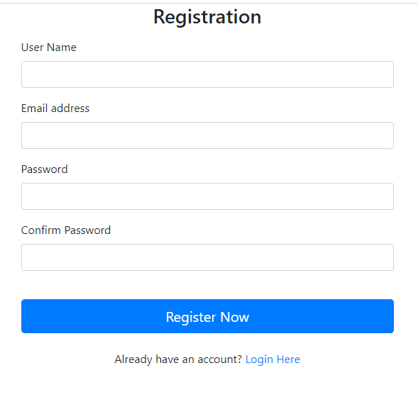
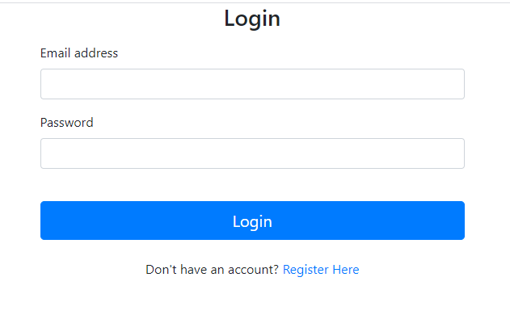
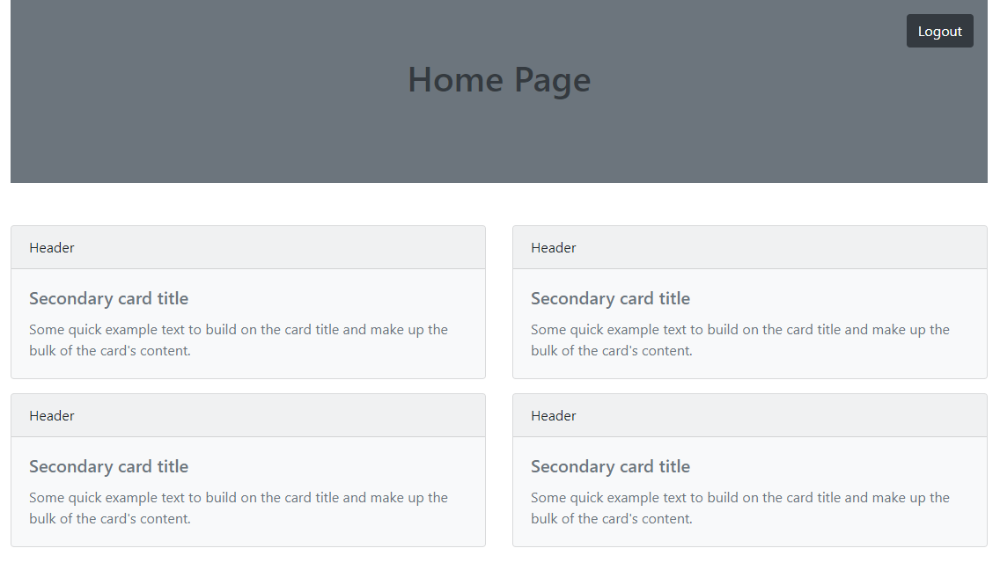

# Membership Project
The complete process of creating a user registration system where users can create an account by providing username, email and password, login and logout using PHP and MySQL.It also show how to make home page accessible only to logged-in users. Any other user not logged in will not be able to access the page.

## Requirements

- PHP 8
- Apache 
- MySQL 8

## Installation

Clone the repository

git clone https://github.com/HsuMonLynn/php-membership.git

Import database from command prompt

- Create database 
- Open Command Prompt
- Type this [Syntax](#syntax)

Syntax-

mysql -u username -p database_name < file.sql

>**username* = Your MySQL username.*  
*database_name* = *Database name in which you want to import.*  
*file.sql* = SQL file name.

## Feature

- [Register](#register)
- [Login](#login)
- [Home](#home)
- [Logout](#logout)

## register

Here is a register page. Must be filled all fields(name, email, password and confirm password). Show alert message if password and confirm password are not same. If password and confirm password are same,those data(name, email and password) save to members table from database and redirect to login page.It should not access after logged in.

## login

Here is a login page to login.Valid password and password from database. Show error message if passwords are not same. If the password is same from database, redirect to home page.It should not access after logged in.

## Home

Here is home page. It can be access after logged in. It should not access without logged in.

## Logout

Logout and redirect to login page.